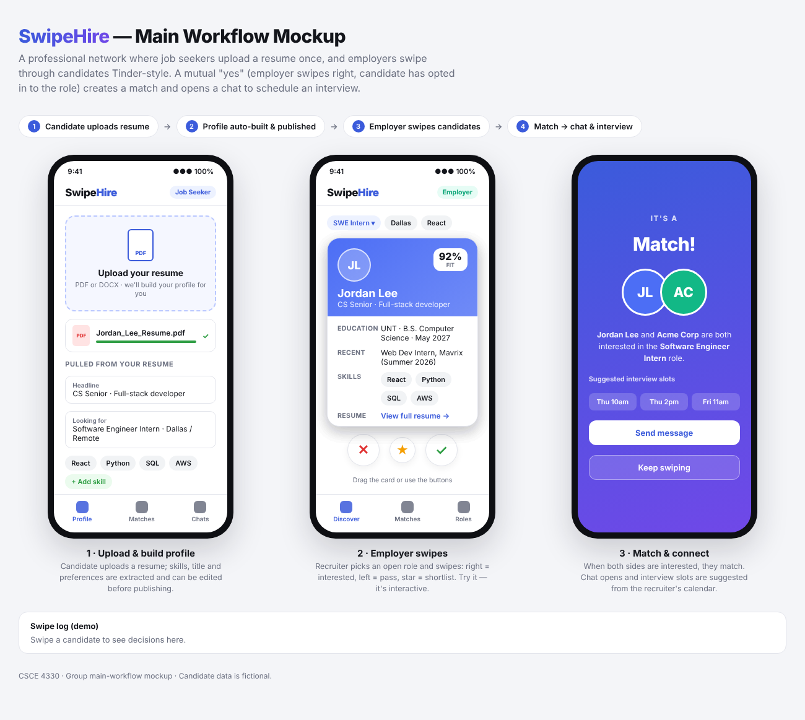

# SwipeHire - main workflow mockup

this is our mockup for the main workflow. basically the idea is linkedin but tinder. you upload your resume and then employers swipe on you lol

to see it just open index.html in your browser. its interactive so you can actually drag the cards around

## how it works

**1. upload resume (job seeker side)**
you upload your resume (pdf or docx) and it pulls out your skills, what job you want, location, etc. you can fix anything it got wrong before you publish your profile

**2. swiping (employer side)**
the recruiter picks which job they're hiring for and then swipes on people
- swipe right / check = interested
- swipe left / X = pass
- star = save them for later

each card has a fit % score, school, most recent job, skills, and a link to the full resume

**3. match**
if the employer swipes right and the candidate is interested in that job too its a match. then they can message each other and set up an interview



## flutter app

theres also a flutter version of the same 3 screens (profile/upload, discover/swiping, matches). all the code is in lib/main.dart

to run it:
```
flutter pub get
flutter run
```

github actions builds the android apk every time someone pushes to main (check the actions tab, the apk is under artifacts)

## files
- index.html - the mockup (no setup needed, just open it)
- mockup.png - screenshot of all 3 screens for the gradescope submission
- lib/main.dart - the flutter app
- test/widget_test.dart - basic tests for swiping + matching
- android, ios, web, windows, macos, linux - platform stuff flutter needs, dont really need to touch these

all the people in the mockup are made up
